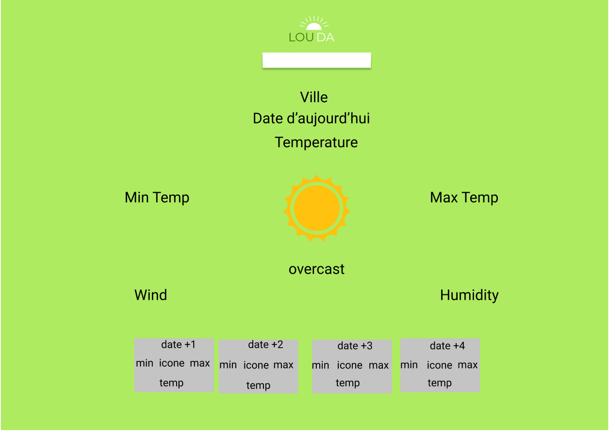

# Application météo

***Collaborator*** 

- [Louise Brunner](https://github.com/lougea)
- [Reda MRabet](https://github.com/redamrabet)
- Temps nécessaire : 3 jours ouvrables
- Où : BeCode 
- Quand: 2-4 Avril 2019
- lien:https://lougea.github.io/API-METEO/dist/index.html

## Projet

Application Météo créé avec VueJS composé d'un input de recherche pour la ville.

## Langages utilisés

- HTML5&CSS3 (GRID)
- VueJS
## Distribution de tâches

Reda & Louise : API, Javascript, Build  Design App,Logo, Maquette, Build
Build Setup

## Build Setup

```
# install dependencies
npm install

# serve with hot reload at localhost:8080
npm run dev

# build for production with minification
npm run build
```
### MAQUETTE



